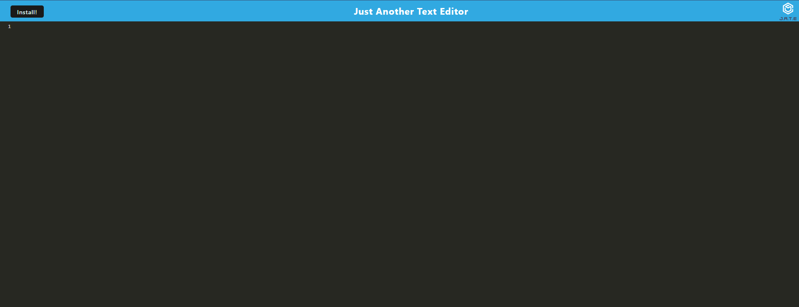

# Texditor
](https://opensource.org/licenses/MIT)

## Description

This project is a simple text editor designed as a Progressive Web App (PWA). The main goal of this project is to provide users with an offline-capable text editing solution that can be installed directly onto their device from the browser.

## Features

-Offline Capabilities: Thanks to service workers and modern web APIs, the text editor can be used even when you're not connected to the internet.
-Installable: The app can be installed on your device, giving you a native app-like experience without needing to go through an app store.
-Integrated Database: Using IndexedDB, your notes and edits are saved directly on your device, ensuring you don't lose your work.
-Modern UI: A user-friendly interface that's easy to navigate and use.

## Live Demo
The app is deployed on Heroku. You can access the live app here.

## Usage

1. Clone the repository:
   git clone [repository-url]

2. Navigate to the project directory:
    cd [project-name]

3. Install the required packages:
   npm install

# Running the App Locally
To run the app locally, use the command:
    npm start

## Contributing

We welcome contributions. Please feel free to submit a pull request or open an issue on GitHub.

## License

This project is licensed under the MIT License.

## Contact

- GitHub: [https://github.com/your-username/your-repo](https://github.com/Nagaft/Note-Web)
- Email: nagaf999@gmail.com

# Acknowledgements

Thanks to Heroku for hosting the application.